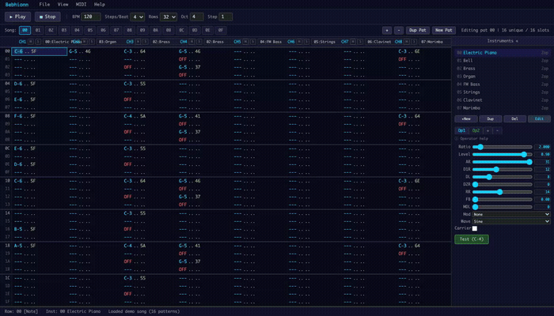
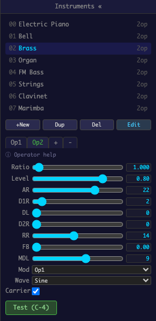
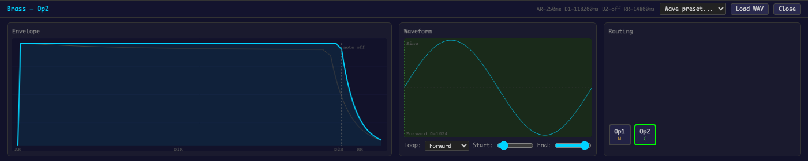
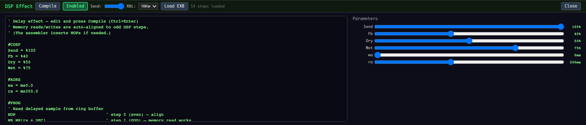

# Bebhionn



| Instrument Editor | Instrument Detail | DSP Effect Editor |
|:-:|:-:|:-:|
|  |  |  |

Bebhionn (pronounced /ˈbeɪvɪn/, or BAY-vin) is a browser-based vertical tracker
for composing music with the Sega Saturn's SCSP (YMF292-F) sound chip. Uses a
hardware-accurate WASM emulator — what you hear is what the Saturn plays (-ish).
Exports SEQ + TON files directly.

[See it LIVE](https://jfsantos.dev/tracker).

## Quick Start

```bash
python3 generate.py
```

This opens the tracker in your browser. No server needed — everything is
bundled into a single HTML file.

## Features

- **16-channel FM tracker** with classic ProTracker-style keyboard input
- **Hardware-accurate SCSP emulation** via WebAssembly (ported from aosdk)
- **FM synthesis editor** with per-operator envelopes, waveforms, and routing
- **DSP effect engine** with in-browser SCSP DSP assembler and real-time parameter knobs
- **MIDI input** for live playing and step entry (Web MIDI API)
- **Import/Export**: MIDI files, Saturn SEQ sequences, TON instrument banks
- **Song arrangement** with pattern reuse, mute/solo, per-channel instruments

## Development

For iterating on the JS without rebundling:

```bash
python3 generate.py --dev -o tracker.html
# Serve from repo root and reload the browser after editing
```

## Project Layout

```
src/
  core/       Engine-agnostic tracker (UI, state, playback, note utils)
  io/         File format handlers (MIDI, SEQ, TON)
  engines/
    scsp/     SCSP FM engine, panels, DSP assembler, WASM build
docs/         Engine guide for building custom sound engines
examples/     Demo MIDI file
test_ton/     Example Saturn TON instrument banks
tests/        Unit and integration tests
generate.py   Generates the self-contained tracker HTML
```

## Documentation

- **[docs/ARCHITECTURE.md](docs/ARCHITECTURE.md)** — start here. How everything
  fits together, the design decisions, and where to begin hacking.
- **[docs/file-formats.md](docs/file-formats.md)** — the MIDI / SEQ / TON / EXB
  / DX7 binary formats.
- **[docs/known-issues.md](docs/known-issues.md)** — honest list of rough edges
  and tech debt.
- **[docs/engine-guide.md](docs/engine-guide.md)** — write your own sound engine.
- **[src/engines/scsp/wasm/PORTING_NOTES.md](src/engines/scsp/wasm/PORTING_NOTES.md)**
  — the SCSP hardware reference (register map, FM ring buffer, pitch encoding).

## Custom Engines

The tracker core is engine-agnostic. You can replace the SCSP engine with
any synthesizer that implements the SoundEngine interface.
See [docs/engine-guide.md](docs/engine-guide.md) for a full walkthrough
and a complete Web Audio subtractive synth example.

## Testing

```bash
node --test                              # JS unit + integration tests (no deps)
python3 -m pytest tests/e2e/ -v          # end-to-end (needs playwright + pytest)
```

## License

All first-party code is under the [BSD 3-Clause License](LICENSE).

The SCSP emulator (`src/engines/scsp/wasm/scsp.cpp`, `scspdsp.cpp`, and headers)
is extracted from the **MAME** project's modern SCSP device and is licensed
**BSD-3-Clause** under the per-file SPDX headers (which override MAME's
project-wide GPL grant). The C bridge and waveform helpers are first-party
BSD-3-Clause. Commercial use is permitted. See
[src/engines/scsp/wasm/LICENSE](src/engines/scsp/wasm/LICENSE) for full details.

> Note: an earlier version of this project used an aosdk-derived SCSP port under
> the pre-2016 MAME license (non-commercial). That code has been replaced; the
> non-commercial restriction no longer applies.
